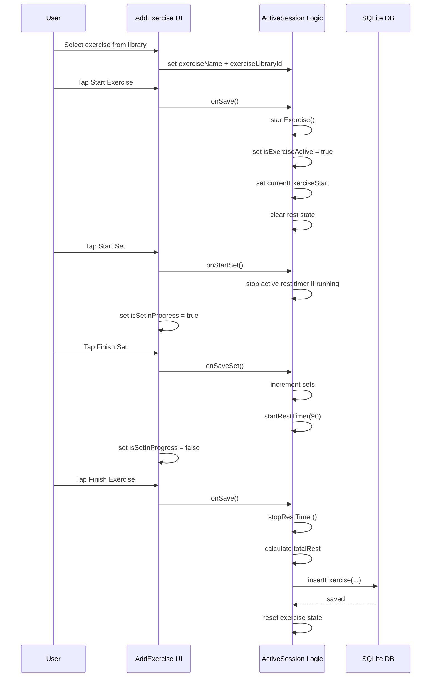
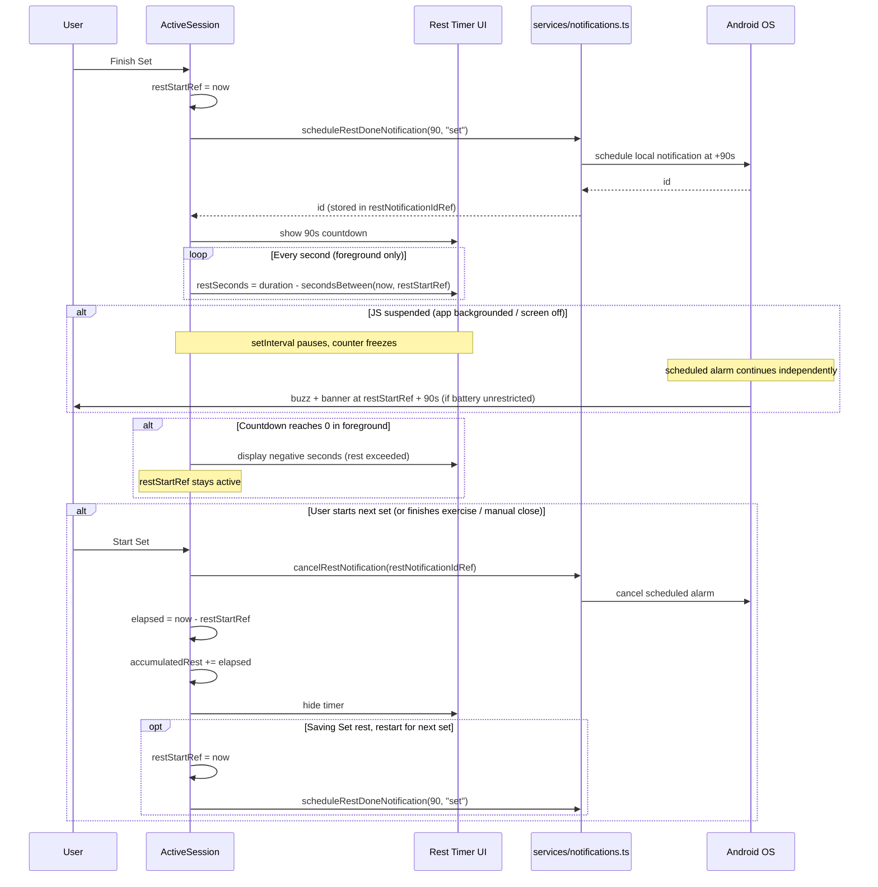
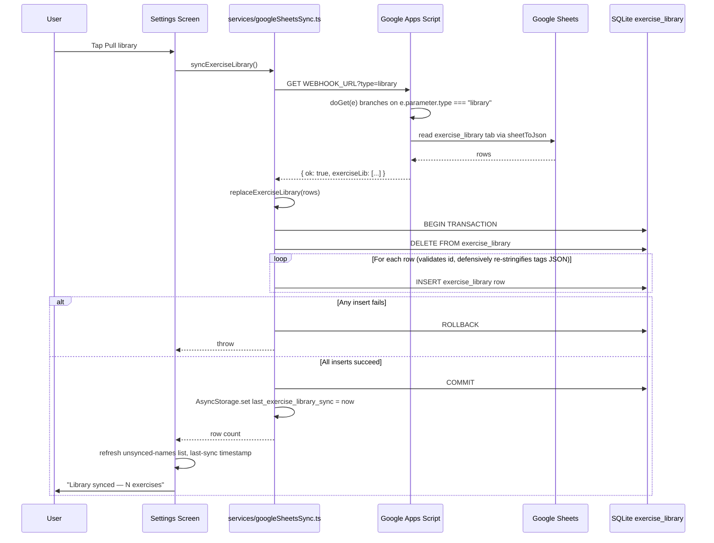
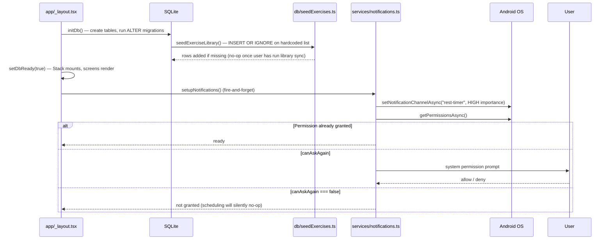
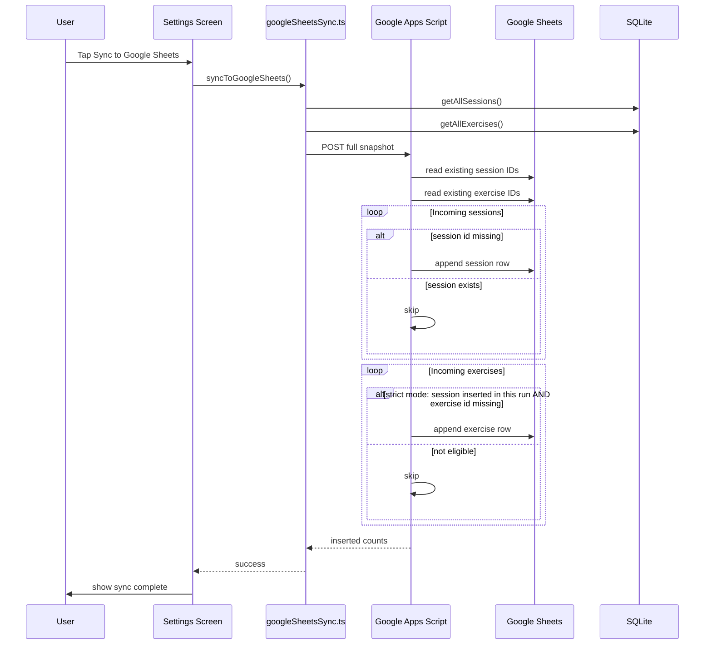

# Sadhana — Architecture, Features, and Current Status

## 1. Core Idea

A mobile-first gym logging application focused on:

- Fast, minimal friction workout tracking
- Accurate rest and session tracking
- Offline-first architecture
- Simple but extensible data model
- Google Sheets as external data/control layer (sync + CMS)

---

## 2. High-Level Architecture

### Layers

#### UI Layer (React Native / Expo)

- Screens: Exercises, Active Session, Settings
- Reads only from local SQLite
- No direct network dependency

#### DB Layer (SQLite)

- Source of truth during runtime
- Tables:
  - `sessions`
  - `exercises`
  - `exercise_library`

#### Service Layer

- Google Sheets sync (sessions + exercises)
- Exercise library sync (Sheets → SQLite)

#### External Layer (Google Sheets)

- Acts as:
  - Backup store
  - Data sync target
  - CMS for exercise library

---

## 3. Key Features Implemented

### 3.1 Workout Logging System

#### Flow

- Start Exercise
- Start Set
- Finish Set → triggers rest
- Start Set → stops rest immediately
- Finish Exercise → saves to DB

#### Important UX Decisions

- Explicit Start Set / Finish Set buttons
- Prevents accidental rest tracking
- Matches real gym behavior

---

### 3.2 Rest Timer System (Major Refactor)

#### Previous Problem

- Rest calculated using countdown logic
- Caused:
  - Lost rest data
  - Race conditions
  - Incorrect 0 values

#### Final Solution (Timestamp-Based)

- On rest start:
  - store `restStartRef = new Date()`
- On rest stop:
  - `elapsed = now - restStartRef`
  - accumulate into `accumulatedRest`

#### Behavior

- Countdown (90s) is visual only
- After 0 → timer continues upward (+seconds)
- Rest ends ONLY when:
  - Start Set
  - Finish Exercise
  - Manual stop

#### Result

- Accurate rest tracking
- No data loss
- Works even with long rests

#### Background behavior (Android, current state, May 2026)

Target platform is Android. When the app is backgrounded (user switches apps, locks screen), Android suspends/throttles the JS thread — `setInterval` stops, JS-driven `Animated` pauses. The system handles this in three coordinated pieces, all keyed off `restStartRef`:

1. **Visible counter (`restSeconds`)** — every `setInterval` tick recomputes the displayed value as `duration - secondsBetween(new Date(), restStartRef.current)`, **not** `prev - 1`. So when JS resumes in the foreground, the next tick (within ~1s) snaps the counter to the correct elapsed value. Counter goes negative past 0 to indicate "rest exceeded". Don't refactor this back to decrementing — that's the broken pattern we replaced.
2. **OS-scheduled local notification** — `services/notifications.ts` schedules an `expo-notifications` time-interval notification at `restStartRef + duration` whenever rest starts. ID kept in `restNotificationIdRef`. Fires regardless of JS state — app backgrounded, screen off, app killed. Two kinds:
   - `"set"` (90s) → title "Rest done", body "Time for your next set"
   - `"transition"` (120s) → title "Next exercise", body "Ready for the next exercise"
3. **Saved rest value** — `secondsBetween(new Date(), restStartRef)` accumulated into `accumulatedRest` on `stopRestTimer`. Wall-clock math, independent of JS thread state.

**Cancellation invariants:** at most one rest notification scheduled at any time. `startRestTimer` cancels any prior `restNotificationIdRef` before scheduling a new one. `stopRestTimer` cancels the saved ID. Every code path that ends rest goes through `stopRestTimer`.

**Notification handler:** `Notifications.setNotificationHandler` runs at module load in `services/notifications.ts`. Without it, `expo-notifications` suppresses banner/sound while the app is foregrounded — meaning the user wouldn't see the buzz if they were staring at the rest screen. Override forces show.

**Android battery optimization caveat:** Doze mode can delay scheduled-notification delivery by 10-30+ seconds when the device is idle. The user must mark the app as "Unrestricted" in system Settings → Apps → Sadhana → Battery for on-time delivery. We don't request `REQUEST_IGNORE_BATTERY_OPTIMIZATIONS` programmatically — that's a documented one-time per-device setup. OEM skins (Samsung, Xiaomi/MIUI, OnePlus, Realme) often add additional restriction layers that need separate whitelisting.

**Known cosmetic drift:** the breathing-cat ring (`Animated.timing` on `restRingProgress`) is JS-driven and pauses in background. After a long background, the ring animation will be out of sync with the numeric counter. Not blocking — counter is the actual signal.

---

### 3.3 Set Tracking UX

- Start Set button (green)
- Finish Set button (red)
- Finish disabled until Start pressed

#### Finish Exercise auto-saves the in-flight set

If a set is mid-flight (`isSetInProgress` in `AddExercise.tsx`) when the user taps **Finish Exercise**, that set is counted as completed before the exercise is recorded — i.e. tapping Finish Exercise is treated as "Finish Set + Finish Exercise" in one gesture. The same PR check that runs in `saveSet()` also runs for the auto-saved set.

Why: previously, `finishExercise()` only read the `sets` counter, which is bumped exclusively in `saveSet()`. Habitual users would tap Finish Exercise on their last set without first tapping Finish Set, silently losing the set. The button label flips to `Finish Set N & Exercise` while a set is active so the behavior is visible; `canFinish` is also relaxed (`sets > 0 || isSetInProgress`) so the very first set can be auto-saved on a single-set exercise. Don't refactor `finishExercise` back to ignore the in-flight set without restoring an equivalent safety net.

#### Enhancements

- Animated set chips
- Visual feedback on set completion
- Minimal cognitive load

---

### 3.4 Exercise Library System

#### Source of truth

Google Sheets is canonical. The user maintains an `exercise_library` tab with columns `id | name | video_url | primary_muscle | tags` (where `tags` is a JSON-array string per cell). The app pulls this into the local `exercise_library` table on demand via `syncExerciseLibrary()`.

The hardcoded list in `db/seedExercises.ts` exists only as a first-install bootstrap — it runs via `INSERT OR IGNORE` inside `seedExerciseLibrary()` so it never overwrites synced rows. Once the user runs library sync, the seed is effectively replaced.

#### Schema

```
exercise_library
- id (TEXT PK)
- name (TEXT)
- video_url (TEXT, nullable)
- primary_muscle (TEXT)
- tags (TEXT, JSON-stringified)
```

#### Sync mechanics (Pass 2, May 2026)

- App calls `fetch(WEBHOOK_URL + "?type=library")` → Apps Script `doGet` branches on `e.parameter.type === "library"` and returns `{ ok: true, exerciseLib: [...] }`.
- `replaceExerciseLibrary()` in `db/exerciseLibrary.ts` runs `BEGIN; DELETE FROM exercise_library; INSERT ...; COMMIT;` (rolls back on any failure). **Full replace, no upsert** — Sheet wins, period.
- `tags` is round-tripped through `JSON.parse → JSON.stringify` defensively; malformed cells become `[]` rather than throwing.

#### Reconciliation: logged-but-not-in-library names

Pass 1 lets users log exercises with names not in the library; the session row stores the typed name as a synthetic `exercise_library_id`. `getLoggedExercisesNotInLibrary()` (in `db/exerciseLibrary.ts`) surfaces these on the Settings screen as a passive list ("Logged but not in library — add these to your Google Sheet's library tab, then sync."). It does **not** auto-write to the Sheet — the user copies them over manually and runs library sync.

#### Entry points

- App boot: `seedExerciseLibrary()` runs as part of `initDb()`. Idempotent.
- Settings → "Sync exercise library" button: pulls from Sheet and full-replaces local table.

---

### 3.5 Google Sheets Sync (Sessions + Exercises)

#### Behavior

- App sends full SQLite snapshot
- Apps Script handles deduplication

#### Deduplication

- Based on ID matching
- IDs normalized to string

#### Strict Mode (Implemented)

- Only insert sessions not present
- Only insert exercises for newly inserted sessions

#### Debug System

- Temporary debug flag added
- Returned:
  - existing counts
  - incoming counts
  - inserted counts

Used to validate correctness.

---

### 3.6 Settings Page

#### Layout (May 2026 refresh)

Settings is sectioned and uses two horizontal button rows instead of stacked full-width buttons. Each button is a two-line label (action verb on top, context line below) at compact font sizes (13/10) so all three sync actions fit on a phone width.

```
[Sync not configured banner — only if env vars missing]

Local backup
[ Export ]   [ Share ]
  save JSON   send backup

Google Sheets
[ Push history ]  [ Restore history ]  [ Pull library ]
   ↑ to Sheets       ↓ from Sheets        ↓ from Sheets

History last pushed: …
Library last pulled: …

Open spreadsheet ↗   ← only if EXPO_PUBLIC_GSHEETS_SPREADSHEET_URL set

Logged but not in library (n)
  · <name> (count×)
  …

[Show Debug JSON]   ← dev panel, sessions/exercises raw dump
```

#### Features

- **Export** — write a local JSON backup file (works with no env vars).
- **Share** — same export, then share-sheet via `expo-sharing`.
- **Push history** (`syncToGoogleSheets`) — POST sessions + exercises snapshot to Apps Script.
- **Restore history** (`restoreFromGoogleSheets`) — destructive. Wipes local sessions/exercises, re-imports from Sheets. `exercise_library` left intact. Confirmation alert before running.
- **Pull library** (`syncExerciseLibrary`) — GET `?type=library`, full-replace local `exercise_library`.
- **Open spreadsheet** — `Linking.openURL` to `EXPO_PUBLIC_GSHEETS_SPREADSHEET_URL`. Only renders if the env var is set.
- **Logged but not in library** — passive list from `getLoggedExercisesNotInLibrary()`. Surfaces names typed into a session that don't match any library row, prompting the user to add them to their Sheet manually then pull.
- **Sync not configured banner** — `isSyncConfigured()` returns false → red banner explains the env var is missing. Sync still attempts, but the user is told upfront the build is broken.

#### Focus refresh

`useFocusEffect` re-reads last-sync timestamps and the unsynced-names list every time the Settings tab gains focus, so logging an unknown exercise → switching tabs → coming back to Settings shows the new entry without an app reload. Same pattern is used in `components/ActiveSession.tsx` (library names for suggestion chips) and `app/(tabs)/exercises.tsx` (the library-listing screen).

---

## 4. Important Architectural Decisions

### 4.1 Offline-First Design

- App never depends on network during workout
- All reads from SQLite
- Sync is async and optional

### 4.2 Separation of Concerns

| Layer    | Responsibility   |
| -------- | ---------------- |
| UI       | Rendering only   |
| DB       | Storage          |
| Services | Network + sync   |

### 4.3 Google Sheets as canonical store

Google Sheets is the source of truth for two things:
- **Sessions + exercises archive** — the app POSTs every logged session to Apps Script, and `restoreFromGoogleSheets` can rebuild the local DB from there.
- **Exercise library** — the user maintains the library tab in the Sheet directly; the app pulls it via `syncExerciseLibrary` (full-replace).

This means the user can edit the library outside the app and have changes propagate on next sync — no app rebuild needed.

### 4.4 Fail-Safe Sync

- Sheets sync is a single POST; failure leaves local DB untouched.
- Restore wipes local sessions/exercises before re-inserting (`wipeDatabase()` then `insertSessionRaw` / `insertExerciseRaw` per row). The `exercise_library` table is left intact during restore.

---

## 5. Current Status

### Completed

- Rest timer (timestamp-based, self-correcting visible counter on background→foreground resume)
- Rest-timer notifications via `expo-notifications` (set rest 90s, exercise transition 120s, foreground display enabled)
- Set tracking UX
- Exercise logging (including unknown names — Pass 1, May 2026)
- Google Sheets sync for sessions + exercises (stable, with strict dedupe)
- Exercise library sync (Sheets → DB, Pass 2, May 2026) + logged-but-not-in-library nudge
- Restore-from-Sheets flow (sessions/exercises only; library untouched)
- Settings UX refresh: sectioned layout, three-button sync row, "Sync not configured" banner, "Open spreadsheet" link
- Focus-based refresh of library data (Home active session, Settings, Exercises tab)
- Debugging system (used and removed)

### Stable Areas

- DB schema
- Sync pipeline
- Rest tracking
- UI interaction model

---

## 6. Known Tradeoffs

### Current Approach

- Full snapshot sync instead of delta

**Pros:**

- Simple
- Reliable

**Cons:**

- Sends redundant data

---

## 7. Future Improvements (Not Yet Implemented)

### Data Layer

- Delta sync for sessions/exercises (based on timestamps) instead of full snapshot
- "Promote to library" auto-write: skip the manual copy step by POSTing logged-but-not-in-library names directly into the Sheet's library tab

### UX

- Rest timer color change after threshold (e.g. red after 0)
- Haptic feedback on set completion
- Active set highlighting
- Quick rest-time picker (60/90/120/180s) instead of fixed 90s/120s
- Warmup-set toggle so warmups don't pollute PR / volume calculations
- Plate calculator (target weight → bar load breakdown)
- Keep screen awake during active session (`expo-keep-awake`)

### Performance

- Memoized DB reads
- Pagination for large datasets

### Notifications

- Re-anchor the breathing-cat ring animation from `restStartRef` so it doesn't drift on long backgrounds
- Programmatic prompt to disable battery optimization (via `expo-intent-launcher` to open the system page) so the user doesn't have to be told manually

---

## 8. Key Files Overview

### Core

- `ActiveSession.tsx` → rest + set logic
- `AddExercise.tsx` → set UX

### DB

- `db/exerciseLibrary.ts`
- `db/seedExercises.ts`

### Services

- `services/googleSheetsSync.ts` — sessions + exercises POST sync, GET-based restore, library sync via `?type=library`, plus `isSyncConfigured()` and `getSpreadsheetUrl()` helpers for the Settings UI.
- `services/notifications.ts` — `expo-notifications` wrapper. Configures the rest-timer Android channel + permission request (`setupNotifications`, called from `_layout.tsx`), exposes `scheduleRestDoneNotification(seconds, kind)` and `cancelRestNotification(id)`, sets a foreground notification handler at module load.

### UI

- `app/(tabs)/exercises.tsx`
- `app/(tabs)/settings.tsx`

---

## 9. Mental Model for New Developers

- SQLite is the runtime truth
- Google Sheets is external sync + CMS
- UI never talks to network directly
- Rest timing is timestamp-based, not timer-based
- Sync is append-only for sessions
- Library sync is replace-all

---

## 10. Sequence Diagrams

### 10.1 Active Exercise + Set Flow



---

### 10.2 Rest Timer Flow



---

### 10.3 Exercise Library Sync Flow



---

### 10.4 App Boot Flow



(There is no auto-sync of the library on boot — `seedExerciseLibrary` only fills empty rows from the hardcoded list. The user pulls the canonical library from Sheets manually via Settings → Pull library. Earlier drafts of this doc described an `ensureExerciseLibrary()` flow; that code never landed.)

---

### 10.5 Google Sheets Workout Sync Flow



---

### 10.6 Restore from Google Sheets Flow

```mermaid
sequenceDiagram
  participant User
  participant SettingsUI as Settings Screen
  participant SyncService as services/googleSheetsSync.ts
  participant AppsScript as Google Apps Script
  participant Sheets as Google Sheets
  participant SQLite as SQLite
  User->>SettingsUI: Tap Restore history
  SettingsUI->>User: "wipes sessions/exercises, library untouched" alert
  User->>SettingsUI: Confirm
  SettingsUI->>SyncService: restoreFromGoogleSheets()
  SyncService->>AppsScript: GET WEBHOOK_URL (no params)
  AppsScript->>AppsScript: doGet(e) — default branch (no e.parameter.type)
  AppsScript->>Sheets: read sessions + exercises + exercise_library tabs
  Sheets-->>AppsScript: rows
  AppsScript-->>SyncService: { sessions, exercises, exerciseLib }
  Note over SyncService: only sessions + exercises are used; exerciseLib is ignored here<br/>(library is managed via the dedicated Pull library action)
  SyncService->>SQLite: wipeDatabase() — DELETE FROM sessions, exercises<br/>(exercise_library left intact)
  loop sessions
    SyncService->>SQLite: insertSessionRaw(row)
  end
  loop exercises
    SyncService->>SQLite: insertExerciseRaw(row)
  end
  SyncService-->>SettingsUI: done
  SettingsUI->>User: "Restore complete"
```

---

## 11. Summary

The system has moved from:

> "UI-driven + hardcoded data"

→ to

> "Data-driven + offline-first + externally controlled"

It is now stable enough for real usage and extensible for future features.
