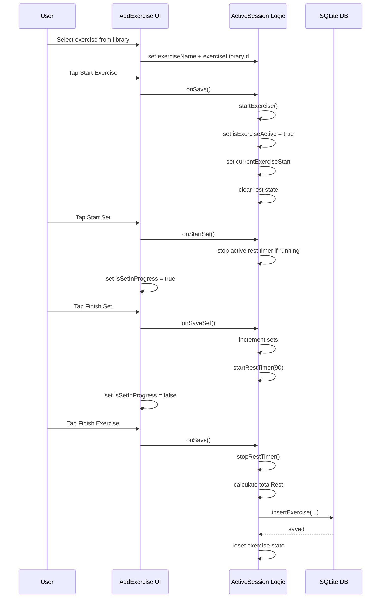
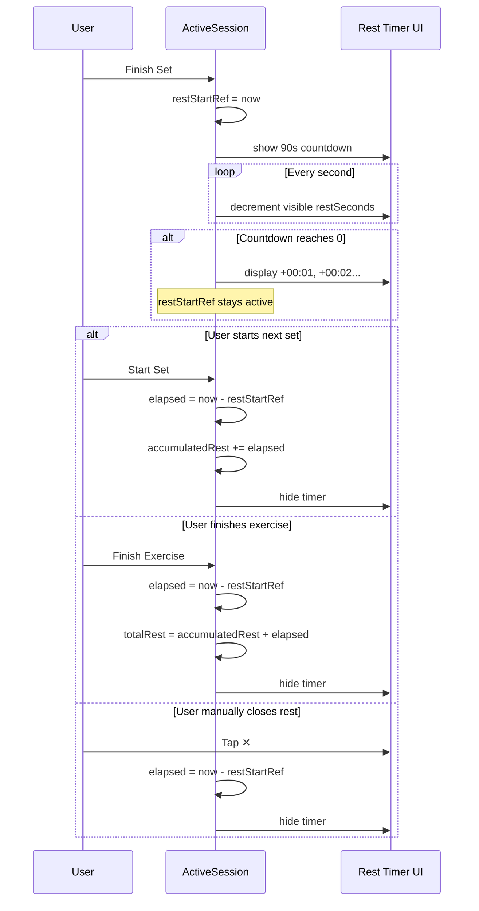
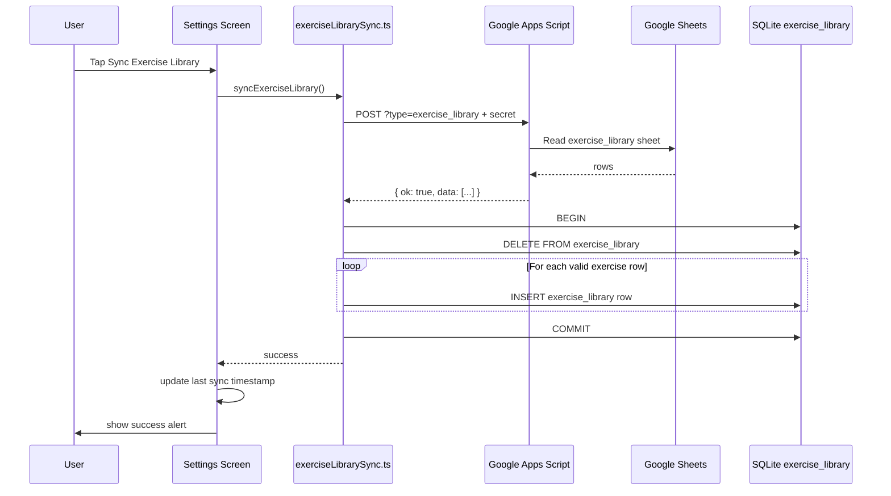
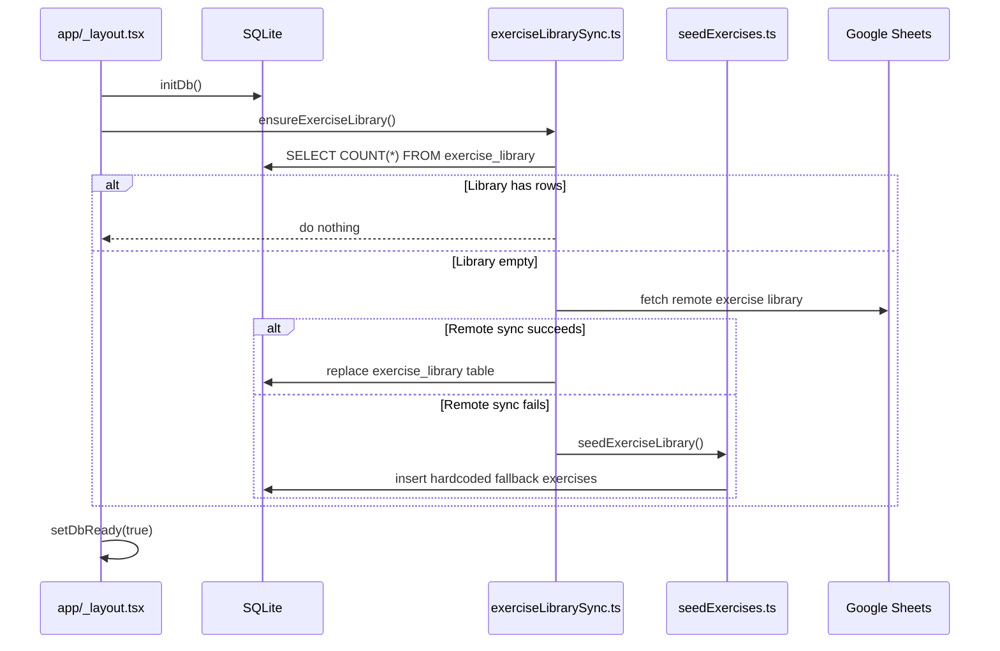
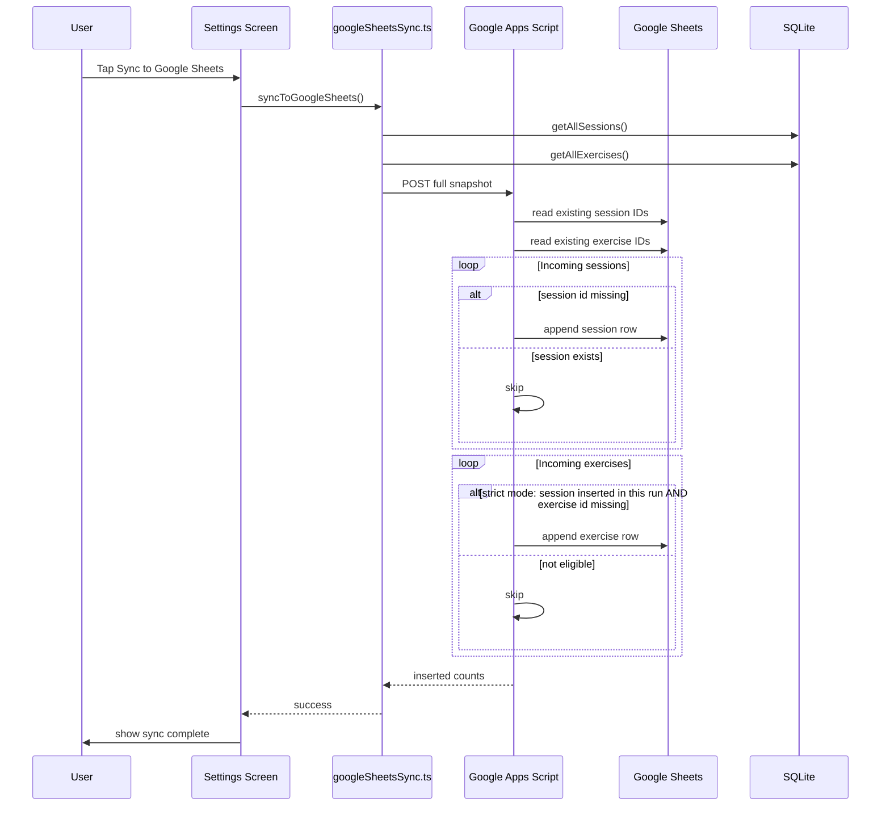
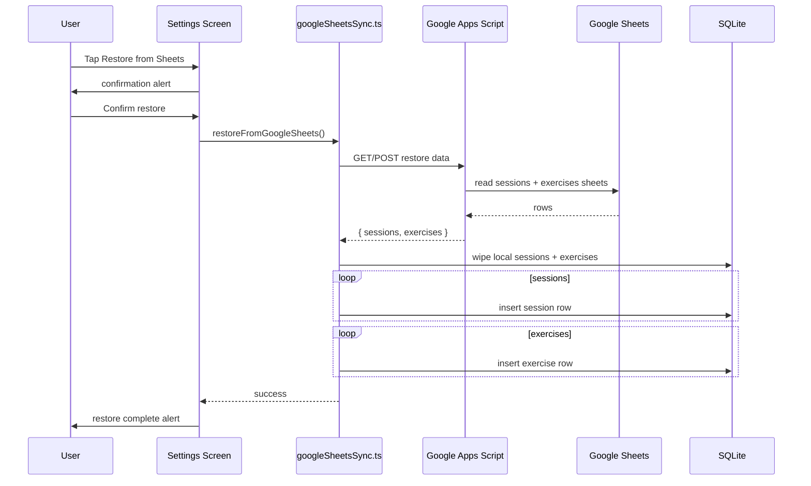

# Gym Log App — Architecture, Features, and Current Status

## 1. Core Idea

A mobile-first gym logging application focused on:

- Fast, minimal friction workout tracking
- Accurate rest and session tracking
- Offline-first architecture
- Simple but extensible data model
- Google Sheets as external data/control layer (sync + CMS)

---

## 2. High-Level Architecture

### Layers

#### UI Layer (React Native / Expo)

- Screens: Exercises, Active Session, Settings
- Reads only from local SQLite
- No direct network dependency

#### DB Layer (SQLite)

- Source of truth during runtime
- Tables:
  - `sessions`
  - `exercises`
  - `exercise_library`

#### Service Layer

- Google Sheets sync (sessions + exercises)
- Exercise library sync (Sheets → SQLite)

#### External Layer (Google Sheets)

- Acts as:
  - Backup store
  - Data sync target
  - CMS for exercise library

---

## 3. Key Features Implemented

### 3.1 Workout Logging System

#### Flow

- Start Exercise
- Start Set
- Finish Set → triggers rest
- Start Set → stops rest immediately
- Finish Exercise → saves to DB

#### Important UX Decisions

- Explicit Start Set / Finish Set buttons
- Prevents accidental rest tracking
- Matches real gym behavior

---

### 3.2 Rest Timer System (Major Refactor)

#### Previous Problem

- Rest calculated using countdown logic
- Caused:
  - Lost rest data
  - Race conditions
  - Incorrect 0 values

#### Final Solution (Timestamp-Based)

- On rest start:
  - store `restStartRef = new Date()`
- On rest stop:
  - `elapsed = now - restStartRef`
  - accumulate into `accumulatedRest`

#### Behavior

- Countdown (90s) is visual only
- After 0 → timer continues upward (+seconds)
- Rest ends ONLY when:
  - Start Set
  - Finish Exercise
  - Manual stop

#### Result

- Accurate rest tracking
- No data loss
- Works even with long rests

#### Background behavior (Android, current state)

Target platform is Android. When the app is backgrounded (user switches apps, locks screen), Android suspends/throttles the JS thread — `setInterval` stops, `Animated` driven by JS pauses. Consequence:

- **Visible countdown freezes** while backgrounded. On return it resumes from where it stopped (does not self-correct), because the displayed seconds are tracked in component state, not derived from `restStartRef`.
- **Saved rest value is still correct.** `stopRestTimer()` computes `secondsBetween(new Date(), restStartRef.current)`, which is wall-clock math and independent of whether JS was running.
- **No alert when rest finishes.** There is no `expo-notifications`, no foreground service, no `AppState` listener anywhere in the repo. The user gets no buzz/banner if the app is not in the foreground at the 90s mark.

Known limitations to fix when this becomes a real problem:

1. Self-correcting visible timer — derive displayed seconds from `restStartRef + now` so the UI snaps to the correct value on resume.
2. Local notification scheduled at `restStartRef + duration` via `expo-notifications` — Android fires it even with the app killed / screen off. Cancel on Start Set / Finish Exercise / manual stop.
3. (Heavier) Foreground service with persistent progress notification, if a live lockscreen ticker is desired.

---

### 3.3 Set Tracking UX

- Start Set button (green)
- Finish Set button (red)
- Finish disabled until Start pressed

#### Enhancements

- Animated set chips
- Visual feedback on set completion
- Minimal cognitive load

---

### 3.4 Exercise Library System

#### Source of truth

The library is **local-only**. It comes from a hardcoded TypeScript list in `db/seedExercises.ts` and is loaded into SQLite via `seedExerciseLibrary()` on every `initDb()` call. The seeder uses `INSERT OR IGNORE`, so it is idempotent — existing rows are never overwritten, new rows in the seed file get added on next boot.

There is **no Google Sheets → library sync**. Earlier drafts of this document described one (`services/exerciseLibrarySync.ts`, `ensureExerciseLibrary()`, full-replace transaction); that code never landed. Do not reason from those mentions.

#### Schema

```
exercise_library
- id (TEXT PK)
- name (TEXT)
- video_url (TEXT, nullable)
- primary_muscle (TEXT)
- tags (TEXT, JSON-stringified)
```

#### Adding new exercises today

- Edit `db/seedExercises.ts` and rebuild. New rows get inserted on next app boot.
- Or (post Pass 1, May 2026): log a workout with an unrecognised name. The session row carries the typed name as both `name` and synthetic `exercise_library_id`, but the **library table itself is not updated** by this path. A "promote to library" UI in Settings (Pass 2) is the planned reconciliation.

#### Entry points

- App boot: `seedExerciseLibrary()` runs as part of `initDb()`.
- No manual library-sync button exists in Settings.

---

### 3.5 Google Sheets Sync (Sessions + Exercises)

#### Behavior

- App sends full SQLite snapshot
- Apps Script handles deduplication

#### Deduplication

- Based on ID matching
- IDs normalized to string

#### Strict Mode (Implemented)

- Only insert sessions not present
- Only insert exercises for newly inserted sessions

#### Debug System

- Temporary debug flag added
- Returned:
  - existing counts
  - incoming counts
  - inserted counts

Used to validate correctness.

---

### 3.6 Settings Page

#### Features

- Export JSON backup
- Share backup
- Sync to Google Sheets (sessions + exercises)
- Restore from Sheets

There is no "Sync exercise library" button. Past drafts mentioned one — it does not exist.

---

## 4. Important Architectural Decisions

### 4.1 Offline-First Design

- App never depends on network during workout
- All reads from SQLite
- Sync is async and optional

### 4.2 Separation of Concerns

| Layer    | Responsibility   |
| -------- | ---------------- |
| UI       | Rendering only   |
| DB       | Storage          |
| Services | Network + sync   |

### 4.3 Google Sheets as session archive

Google Sheets stores a copy of every session and exercise the user logs, via the Apps Script POST endpoint. It is a one-way archive + restore mechanism, not a CMS — the library is **not** managed in Sheets.

### 4.4 Fail-Safe Sync

- Sheets sync is a single POST; failure leaves local DB untouched.
- Restore wipes local sessions/exercises before re-inserting (`wipeDatabase()` then `insertSessionRaw` / `insertExerciseRaw` per row). The `exercise_library` table is left intact during restore.

---

## 5. Current Status

### Completed

- Rest timer (correct, production-safe)
- Set tracking UX
- Exercise logging (including unknown names — Pass 1, May 2026)
- Google Sheets sync for sessions + exercises (stable, with strict dedupe)
- Restore-from-Sheets flow
- Settings integration
- Debugging system (used and removed)

### Stable Areas

- DB schema
- Sync pipeline
- Rest tracking
- UI interaction model

---

## 6. Known Tradeoffs

### Current Approach

- Full snapshot sync instead of delta

**Pros:**

- Simple
- Reliable

**Cons:**

- Sends redundant data

---

## 7. Future Improvements (Not Yet Implemented)

### Data Layer

- Delta sync for sessions/exercises (based on timestamps) instead of full snapshot
- "Promote to library" flow (Pass 2): surface logged exercise names that aren't in `exercise_library` and let the user add them with a muscle group, so they show up as suggestion chips next time

### UX

- Rest timer color change after threshold
- Haptic feedback on set completion
- Active set highlighting

### Settings

- Manual refresh on Exercises screen

### Performance

- Memoized DB reads
- Pagination for large datasets

---

## 8. Key Files Overview

### Core

- `ActiveSession.tsx` → rest + set logic
- `AddExercise.tsx` → set UX

### DB

- `db/exerciseLibrary.ts`
- `db/seedExercises.ts`

### Services

- `services/googleSheetsSync.ts` — only sync service; covers sessions + exercises POST and the GET-based restore. No library sync.

### UI

- `app/(tabs)/exercises.tsx`
- `app/(tabs)/settings.tsx`

---

## 9. Mental Model for New Developers

- SQLite is the runtime truth
- Google Sheets is external sync + CMS
- UI never talks to network directly
- Rest timing is timestamp-based, not timer-based
- Sync is append-only for sessions
- Library sync is replace-all

---

## 10. Sequence Diagrams

### 10.1 Active Exercise + Set Flow



---

### 10.2 Rest Timer Flow



---

### 10.3 Exercise Library Sync Flow



---

### 10.4 Auto Exercise Library Bootstrap Flow



---

### 10.5 Google Sheets Workout Sync Flow



---

### 10.6 Restore from Google Sheets Flow



---

## 11. Summary

The system has moved from:

> "UI-driven + hardcoded data"

→ to

> "Data-driven + offline-first + externally controlled"

It is now stable enough for real usage and extensible for future features.
